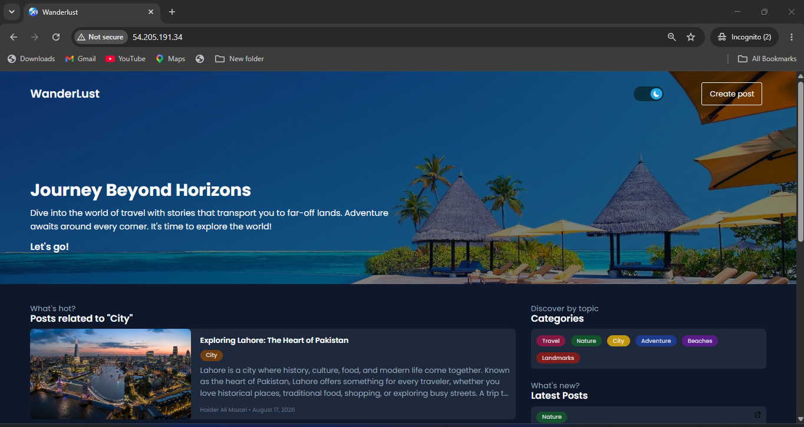
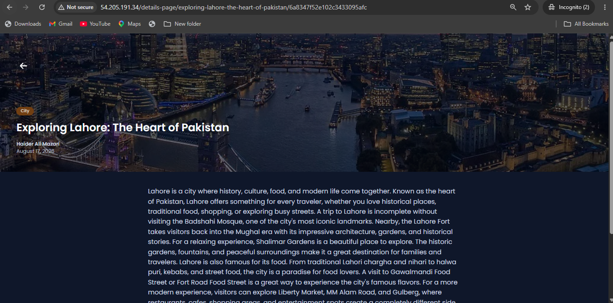
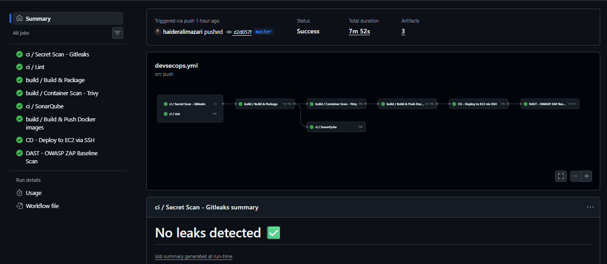
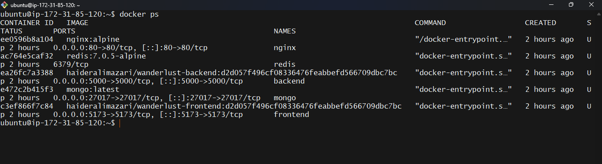
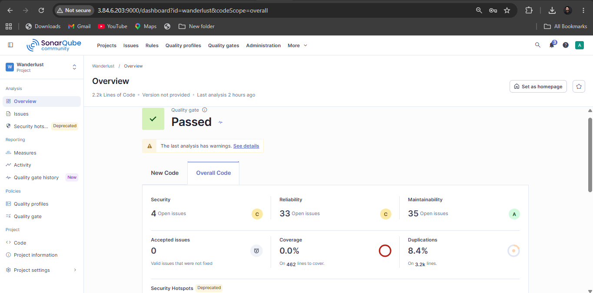
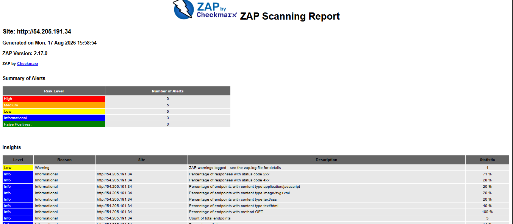

# 🌍 WanderLust — Travel Blog with Full DevSecOps Pipeline

travel blog application built with **React + Vite**, **Express**, **MongoDB**, and **Redis** — deployed on **AWS EC2** through a fully automated **DevSecOps CI/CD pipeline** using GitHub Actions. SonarQube is **self-hosted on EC2** for static code analysis.

---

## 📸 Screenshots

### 🌐 Application

| Homepage | Blog Post Detail |
|:---:|:---:|
|  |  |

### ⚙️ CI/CD Pipeline



> All 8 jobs passed in **7m 52s** — triggered on push to `master`

### 🐳 Running Containers on EC2



### 🔒 Security Scans

| SonarQube — Self-hosted on EC2 (SAST) | OWASP ZAP (DAST) |
|:---:|:---:|
|  |  |

---

## 🏗️ Architecture Overview

```
GitHub Push
    │
    ▼
┌──────────────────────────────────────────────────────────────┐
│                    GitHub Actions Pipeline                    │
│                                                              │
│   Secret Scan (Gitleaks)   Lint                              │
│          │                   │                               │
│          └────────┬──────────┘                               │
│                   ▼                                          │
│           Build & Package                                    │
│          │              │                                    │
│   Container Scan      SonarQube                              │
│     (Trivy)           (SAST on EC2)                          │
│          │                                                   │
│   Build & Push Docker Images → DockerHub                     │
│          │                                                   │
│   CD — Deploy to EC2 via SSH                                 │
│          │                                                   │
│   DAST — OWASP ZAP Baseline Scan                             │
└──────────────────────────────────────────────────────────────┘
                        │
                        ▼
            ┌───────────────────────┐
            │       AWS EC2         │
            │                       │
            │  nginx        :80     │
            │  frontend     :5173   │
            │  backend      :5000   │
            │  mongo        :27017  │
            │  redis        :6379   │
            │  sonarqube    :9000   │ ← self-hosted
            └───────────────────────┘
```

---

## 🔒 DevSecOps Security Features

| Stage | Tool | Type | What It Checks |
|---|---|---|---|
| Pre-build | **Gitleaks** | Secret Scan | Hardcoded secrets, API keys, tokens in commits |
| Static Analysis | **SonarQube** (EC2) | SAST | Code quality, bugs, vulnerabilities, code smells |
| Container | **Trivy** | Image Scan | CVEs in Docker images and OS packages |
| Post-deploy | **OWASP ZAP** | DAST | Runtime web vulnerabilities on live application |

### Latest Scan Results

| Tool | Result |
|---|---|
| 🔑 Gitleaks | No leaks detected ✅ |
| 🧪 SonarQube | Quality Gate **Passed** — 4 Security, 33 Reliability, 35 Maintainability issues |
| 🐳 Trivy | Container scan passed ✅ |
| 🕷️ OWASP ZAP | **0 High**, 5 Medium, 5 Low alerts — no critical vulnerabilities ✅ |

---

## 🗂️ Project Structure

```
Wanderlust/
├── frontend/                   # React + TypeScript + Vite
├── backend/                    # Express API + MongoDB + Redis
├── nginx/
│   └── default.conf            # Reverse proxy config (port 80)
├── .github/
│   └── workflows/
│       └── devsecops.yml       # Full CI/CD + security pipeline
├── docker-compose.yml          # Local development
├── docker-compose.prod.yml     # Production (pull from DockerHub)
└── README.md
```

---

## 🚀 Getting Started

### Prerequisites

- Node.js 20+
- Docker & Docker Compose
- Git

### Local Development (without Docker)

```bash
# Clone the repo
git clone https://github.com/haideralimazari/Wanderlust.git
cd Wanderlust

# Install all dependencies
npm install
npm run install-backend
npm run install-frontend

# Start both services
npm start
```

| Service | URL |
|---|---|
| Frontend | http://localhost:5173 |
| Backend API | http://localhost:5000/api/posts |

### Local Development (with Docker)

```bash
docker compose up -d --build
```

Stop services:

```bash
docker compose down
```

---

## 🐳 Docker Images

Images are published to DockerHub automatically on every push to `master`:

| Image | Tag |
|---|---|
| `haideralimazari/wanderlust-backend` | `latest` |
| `haideralimazari/wanderlust-frontend` | `latest` |

**Running containers on EC2** (`docker ps`):

```
CONTAINER       IMAGE                                   PORTS                    NAME
ee0596b8a104    nginx:alpine                            0.0.0.0:80->80/tcp       nginx
ac764e5caf32    redis:7.0.5-alpine                      6379/tcp                 redis
ea26fc7a3388    haideralimazari/wanderlust-backend      0.0.0.0:5000->5000/tcp   backend
e472c2b415f3    mongo:latest                            0.0.0.0:27017->27017/tcp mongo
c3ef866f7c84    haideralimazari/wanderlust-frontend     0.0.0.0:5173->5173/tcp   frontend
```

---

## ⚙️ CI/CD Pipeline

Defined in `.github/workflows/devsecops.yml`. Triggers on every push to `master`.

### Pipeline Flow

```
ci/Secret Scan - Gitleaks  ──┐
ci/Lint                    ──┤
                              ▼
                    build/Build & Package
                       │              │
             build/Container        ci/SonarQube
             Scan - Trivy           (self-hosted)
                       │
             build/Build & Push Docker Images
                       │
             CD - Deploy to EC2 via SSH
                       │
             DAST - OWASP ZAP Baseline Scan
```

**Total runtime:** ~7m 52s | **Status:** ✅ Success | **Artifacts:** 3

---

## 🧪 SonarQube — Self-Hosted on EC2

SonarQube Community Edition is deployed on the same EC2 instance and accessible at port `:9000`.

The GitHub Actions pipeline sends analysis results to this self-hosted instance on every push.

```bash
# SonarQube is running as a Docker container on EC2
# Access dashboard at: http://<EC2-IP>:9000
# Project: Wanderlust — 2.2k Lines of Code
# Quality Gate: Passed ✅
```

---

## 🌐 Production Deploy

###  Pull prebuilt images from DockerHub

```bash
docker compose -f docker-compose.yml up -d
```

---

## 🔧 Environment Variables

| File | Purpose |
|---|---|
| `backend/.env.docker` | Backend runtime config for Docker |
| `frontend/.env.docker` | Frontend runtime config for Docker |
| `frontend/.env.sample` | Fallback values for local dev |

Key variables:

```env
# frontend
VITE_API_PATH=/api

# backend
MONGO_URI=mongodb://mongo:27017/wanderlust
REDIS_URL=redis://redis:6379

# sonarqube (in GitHub Secrets)
SONAR_HOST_URL=http://<EC2-IP>:9000
SONAR_TOKEN=<your-token>
```

---

## 🛠️ Useful Commands

```bash
# Frontend
cd frontend && npm run dev          # start dev server
cd frontend && npm run build        # production build
cd frontend && npm run lint         # ESLint check

# Backend
cd backend && npm start             # start API server
cd backend && npm test              # run tests

# Docker
docker compose up -d --build        # start all services
docker compose logs -f backend      # stream backend logs
docker compose down                 # stop all services
docker ps                           # check running containers
```

---

## 🐛 Troubleshooting

**`docker compose` fails on remote EC2**  
Use `docker-compose.yml` — images must already exist on DockerHub

**`frontend/.env.docker` missing**  
Dockerfiles fall back to `frontend/.env.sample` and `backend/.env.sample` automatically.

**Duplicate `/api/api/` in API calls**  
Check `VITE_API_PATH` in `frontend/.env.sample` — should be `/api`, not `/api/`.

**SonarQube not receiving analysis**  
Verify `SONAR_HOST_URL` and `SONAR_TOKEN` are set correctly in GitHub repository secrets.

**ZAP scan 4xx errors in Insights**  
Expected — ZAP probes return 4xx on baseline scan. No High alerts means the app is safe.

---

## 🧰 Tech Stack

| Layer | Technology |
|---|---|
| **Frontend** | React 18, TypeScript, Vite |
| **Backend** | Node.js, Express, Mongoose |
| **Database** | MongoDB, Redis (caching) |
| **Proxy** | NGINX (reverse proxy, port 80) |
| **Infrastructure** | AWS EC2 |
| **Containerization** | Docker, Docker Compose |
| **CI/CD** | GitHub Actions |
| **Security** | Gitleaks, SonarQube (self-hosted), Trivy, OWASP ZAP |

---

## 👤 Author

**Haider Ali Mazari**  
 
[GitHub](https://github.com/haideralimazari) · [LinkedIn](https://linkedin.com/in//haider-ali-mazari-90b018261/)
